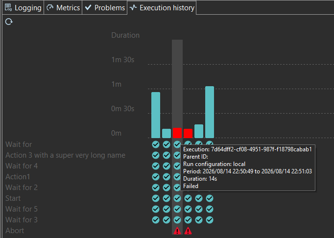

////
Licensed to the Apache Software Foundation (ASF) under one
or more contributor license agreements.  See the NOTICE file
distributed with this work for additional information
regarding copyright ownership.  The ASF licenses this file
to you under the Apache License, Version 2.0 (the
"License"); you may not use this file except in compliance
with the License.  You may obtain a copy of the License at
  http://www.apache.org/licenses/LICENSE-2.0
Unless required by applicable law or agreed to in writing,
software distributed under the License is distributed on an
"AS IS" BASIS, WITHOUT WARRANTIES OR CONDITIONS OF ANY
KIND, either express or implied.  See the License for the
specific language governing permissions and limitations
under the License.
////
= Hop Execution History Plugin
:url-sonarcloud: https://sonarcloud.io/dashboard?id=hop-execution-history

image:https://sonarcloud.io/api/project_badges/measure?project=hop-execution-history&metric=alert_status[Sonarcloud,link={url-sonarcloud}]
image:https://sonarcloud.io/api/project_badges/measure?project=hop-execution-history&metric=coverage[Sonarcloud,link={url-sonarcloud}]

== Overview

Apache Hop plugin dealing with the history of pipeline and workflow executions.

== Requirements

* JDK 21
* Apache Maven 3.6.3 or higher
* Apache Hop 2.19.0 (see the `hop.version` property in `pom.xml`)

== Build

[source,shell]
----
mvn clean verify
----

The build produces `target/hop-execution-history-<version>.zip`, a ready to unpack Hop plugin
archive with the following layout:

----
plugins/misc/execution-history/
├── hop-execution-history-<version>.jar
└── version.xml
----

== Installation

`mvn clean install` unzips the archive into the Hop installation pointed to by the `hop.home`
property (`C:\hop` by default), under `custom/plugins/misc/execution-history`. Override it for
another installation:

[source,shell]
----
mvn clean install -Dhop.home=/opt/hop
----

For a manual installation, unzip `target/hop-execution-history-<version>.zip` into the `plugins`
folder of the Hop installation and restart Hop.

== Code quality

The Apache Hop parent POM wires the checks used by the project:

* `apache-rat:check` - license headers, runs during `verify`
* `checkstyle:check` - coding rules from `tools/maven/checkstyle.xml`
* `spotless:apply` - google-java-format, runs automatically during `compile`

Use the `fast-build` profile to skip them while iterating:

[source,shell]
----
mvn clean install -Pfast-build
----

== License

Licensed under the Apache License, Version 2.0. See the link:LICENSE[LICENSE] file.
